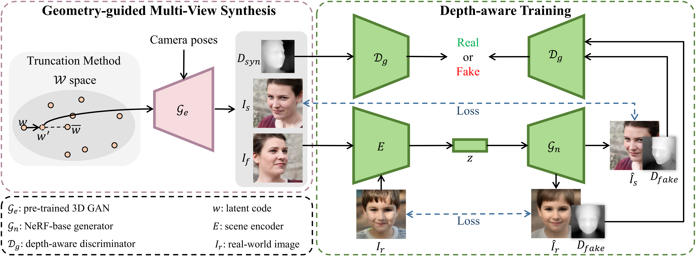

# G-NeRF: Geometry-enhanced Novel View Synthesis from Single-View Images

## Official PyTorch implementation of the CVPR 2024 paper

### [Project Page](https://llrtt.github.io/G-NeRF.gitHub.io/)| [arXiv Paper](https://arxiv.org/abs/2310.08528)

## Requirements

* CUDA toolkit 11.3 or later.  (Why is a separate CUDA toolkit installation required?  We use the custom CUDA extensions from the StyleGAN3 repo. Please see [Troubleshooting](https://github.com/NVlabs/stylegan3/blob/main/docs/troubleshooting.md#why-is-cuda-toolkit-installation-necessary)).
* Python libraries: see [environment.yml](./eg3d/environment.yml) for exact library dependencies.  You can use the following commands with Miniconda3 to create and activate your Python environment:
  - `cd eg3d`
  - `conda env create -f environment.yml`
  - `conda activate eg3d`

In our environment, we use pytorch=1.13.1+cu116.

## Data Preparation

**For synthetic scenes:**
The dataset provided in [D-NeRF](https://github.com/albertpumarola/D-NeRF) is used. You can download the dataset from [dropbox](https://www.dropbox.com/s/0bf6fl0ye2vz3vr/data.zip?dl=0).

**For real dynamic scenes:**
The dataset provided in [HyperNeRF](https://github.com/google/hypernerf) is used. You can download scenes from [Hypernerf Dataset](https://github.com/google/hypernerf/releases/tag/v0.1) and organize them as [Nerfies](https://github.com/google/nerfies#datasets). Meanwhile, [Plenoptic Dataset](https://github.com/facebookresearch/Neural_3D_Video) could be downloaded from their official websites. To save the memory, you should extract the frames of each video and then organize your dataset as follows.

```
├── data
│   | dnerf 
│     ├── mutant
│     ├── standup 
│     ├── ...
│   | hypernerf
│     ├── interp
│     ├── misc
│     ├── virg
│   | dynerf
│     ├── cook_spinach
│       ├── cam00
│           ├── images
│               ├── 0000.png
│               ├── 0001.png
│               ├── 0002.png
│               ├── ...
│       ├── cam01
│           ├── images
│               ├── 0000.png
│               ├── 0001.png
│               ├── ...
│     ├── cut_roasted_beef
|     ├── ...
```

## Training

For training synthetic scenes such as `bouncingballs`, run

```
python train.py -s data/dnerf/bouncingballs --port 6017 --expname "dnerf/bouncingballs" --configs arguments/dnerf/bouncingballs.py 
```

For training dynerf scenes such as `cut_roasted_beef`, run
```python
# First, extract the frames of each video.
python scripts/preprocess_dynerf.py --datadir data/dynerf/cut_roasted_beef
# Second, generate point clouds from input data.
bash colmap.sh data/dynerf/cut_roasted_beef llff
# Third, downsample the point clouds generated in the second step.
python scripts/downsample_point.py data/dynerf/cut_roasted_beef/colmap/dense/workspace/fused.ply data/dynerf/cut_roasted_beef/points3D_downsample2.ply
# Finally, train.
python train.py -s data/dynerf/cut_roasted_beef --port 6017 --expname "dynerf/cut_roasted_beef" --configs arguments/dynerf/cut_roasted_beef.py 
```
For training hypernerf scenes such as `virg/broom`, run
```python
# First, computing dense point clouds by COLMAP
bash colmap.sh data/hypernerf/virg/broom2 hypernerf
# Second, downsample the point clouds generated in the first step.
python scripts/downsample_point.py data/hypernerf/virg/broom2/colmap/dense/workspace/fused.ply data/hypernerf/virg/broom2/points3D_downsample2.ply
# Finally, train.
python train.py -s  data/hypernerf/virg/broom2/ --port 6017 --expname "hypernerf/broom2" --configs arguments/hypernerf/broom2.py 
```

For your custom datasets, install nerfstudio and follow their colmap pipeline.

```python
pip install nerfstudio
# computing camera poses by colmap pipeline
ns-process-data images --data data/your-data --output-dir data/your-ns-data
cp -r data/your-ns-data/images data/your-ns-data/colmap/images
python train.py -s data/your-ns-data/colmap --port 6017 --expname "custom" --configs arguments/hypernerf/default.py 
```
You can customize your training config through the config files.

## Checkpoint

Also, you can training your model with checkpoint.

```python
python train.py -s data/dnerf/bouncingballs --port 6017 --expname "dnerf/bouncingballs" --configs arguments/dnerf/bouncingballs.py --checkpoint_iterations 200 # change it.
```

Then load checkpoint with:

```python
python train.py -s data/dnerf/bouncingballs --port 6017 --expname "dnerf/bouncingballs" --configs arguments/dnerf/bouncingballs.py --start_checkpoint "output/dnerf/bouncingballs/chkpnt_coarse_200.pth"
# finestage: --start_checkpoint "output/dnerf/bouncingballs/chkpnt_fine_200.pth"
```

## Rendering

Run the following script to render the images.

```
python render.py --model_path "output/dnerf/bouncingballs/"  --skip_train --configs arguments/dnerf/bouncingballs.py  &
```

## Evaluation

You can just run the following script to evaluate the model.

```
python metrics.py --model_path "output/dnerf/bouncingballs/" 
```


## Viewer
[Watch me](./docs/viewer_usage.md)
## Scripts

There are some helpful scripts, please feel free to use them.

`export_perframe_3DGS.py`:
get all 3D Gaussians point clouds at each timestamps.

usage:

```python
python export_perframe_3DGS.py --iteration 14000 --configs arguments/dnerf/lego.py --model_path output/dnerf/lego 
```

You will a set of 3D Gaussians are saved in `output/dnerf/lego/gaussian_pertimestamp`.

`weight_visualization.ipynb`:

visualize the weight of Multi-resolution HexPlane module.

`merge_many_4dgs.py`:
merge your trained 4dgs.
usage:

```python
export exp_name="dynerf"
python merge_many_4dgs.py --model_path output/$exp_name/sear_steak
```

`colmap.sh`:
generate point clouds from input data

```bash
bash colmap.sh data/hypernerf/virg/vrig-chicken hypernerf 
bash colmap.sh data/dynerf/sear_steak llff
```

**Blender** format seems doesn't work. Welcome to raise a pull request to fix it.

`downsample_point.py` :downsample generated point clouds by sfm.

```python
python scripts/downsample_point.py data/dynerf/sear_steak/colmap/dense/workspace/fused.ply data/dynerf/sear_steak/points3D_downsample2.ply
```

In my paper, I always use `colmap.sh` to generate dense point clouds and downsample it to less than 40000 points.

Here are some codes maybe useful but never adopted in my paper, you can also try it.

## Citation

```
@inproceedings{huang2024,
  author = {Zixiong, Huang and Qi, Chen and Libo, Sun and Yifan, Yang and Naizhou, Wang and Mingkui, Tan and Qi, Wu},
  title = {G-NeRF: Geometry-enhanced Novel View Synthesis from Single-View Images},
  booktitle = {CVPR},
  year = {2024}
}
```

## Acknowledgement

 Our code is modified from [EG3D](https://github.com/NVlabs/eg3d/tree/main). Thanks for their awesome work!